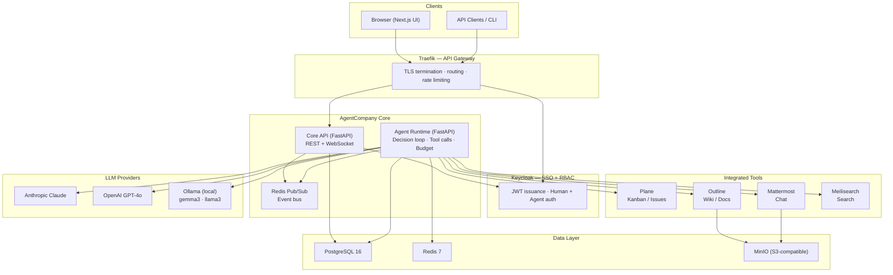

# agentcompany

## 🔗 Quick Links

- [View on GitHub](https://github.com/aaron777collins/agentcompany)

## 📊 Project Details

- **Primary Language:** Python
- **Languages Used:** Python, TypeScript, Shell, CSS, Dockerfile, JavaScript
- **License:** MIT License
- **Created:** April 18, 2026
- **Last Updated:** April 26, 2026

## 📝 About

# 🏢 AgentCompany

> Build and run AI-powered companies with open-source tools

[](https://opensource.org/licenses/MIT)
[](https://github.com/aaron777collins/agentcompany/actions)
[](https://docs.docker.com/compose/)

**AgentCompany** is an open-source platform that creates AI-powered company structures where agents and humans collaborate using integrated project management, documentation, and communication tools.

Think "Paperclip" meets "Linear" — real enterprise tools, beautiful UI, modular adapters, and cost-aware agent management.

---

## ✨ Features

| Feature | Description |
|---------|-------------|
| 🤖 **AI Agent Roles** | Deploy agents as CEO, CTO, PM, Developer, Analyst, and more — each with their own system prompt, personality, and authority level |
| 📊 **Integrated Kanban** | Plane-powered project management that agents and humans share; agents create, update, and close issues automatically |
| 📝 **Knowledge Base** | Outline wiki where agents write documentation, research notes, and specs visible to the whole team |
| 💬 **Team Chat** | Mattermost channels where agents post updates, respond to @mentions, and escalate to humans |
| 🔍 **Unified Search** | Meilisearch indexes tasks, documents, and messages so agents retrieve context across all tools in one query |
| 🧠 **Multiple LLMs** | Claude (Anthropic), GPT-4o (OpenAI), and Ollama for local models (gemma3, llama3) — configurable per agent |
| 💰 **Cost Controls** | Per-agent daily and monthly token budgets enforced at runtime; agents pause automatically when the limit is hit |
| 🔒 **Governance & Audit** | Every agent action is logged immutably; high-risk operations require human approval before execution |
| 🐳 **One-Command Deploy** | Full stack via Docker Compose with healthchecks, secret injection, and a first-run setup script |
| 📈 **Built-in Observability** | Prometheus metrics, Grafana dashboards, and Loki log aggregation for every service |

---

## 🏗️ Architecture

AgentCompany is built on a layered architecture: a Next.js web UI talks to a FastAPI Core API, which routes work to an Agent Runtime that drives LLM decision loops and calls tool adapters.



All services communicate over a private Docker bridge network — only Traefik is exposed to the host.

---

## 🚀 Quick Start

### Prerequisites

- **Docker** 24+ and **Docker Compose** v2
- **8 GB RAM** minimum (16 GB recommended if running Ollama)
- **Git** 2.x

### Install

```bash
git clone https://github.com/aaron777collins/agentcompany.git
cd agentcompany
./scripts/setup.sh
```

`setup.sh` generates secrets, pulls images, builds the custom services, and starts the full stack. The first run takes 3–5 minutes while images download.

### Seed demo data

```bash
./scripts/seed-data.sh
```

Creates a sample company, org roles, agent roster, a Kanban project board, a welcome document, and a Mattermost channel — ready to explore immediately.

### Access the platform

| Service | URL | Credentials |
|---------|-----|-------------|
| **Dashboard** | http://localhost | See `.env` for admin user |
| **API docs** | http://localhost/api/docs | Bearer token from Keycloak |
| **Keycloak** | http://localhost/auth | `KEYCLOAK_ADMIN_USER` / `KEYCLOAK_ADMIN_PASSWORD` from `.env` |
| **Mattermost** | http://localhost/chat | Created during first-run setup |
| **Outline** | http://localhost/docs | SSO via Keycloak |
| **Traefik** | http://localhost:8080 | Dashboard (dev only) |
| **Grafana** | http://localhost/metrics | Observability dashboards |

---

## 📖 Documentation

| Document | Description |
|----------|-------------|
| [Getting Started](docs/getting-started.md) | First-run walkthrough: create a company, add an agent, watch it work |
| [Configuration](docs/configuration.md) | All environment variables, LLM provider setup, GPU configuration, production checklist |
| [Architecture](docs/architecture/README.md) | Index of all architecture decision records and design specs |
| [Contributing](CONTRIBUTING.md) | Development setup, code style, how to add adapters and roles |

---

## 🛠️ Tech Stack

### First-party services

| Service | Language / Framework | Role |
|---------|---------------------|------|
| Agent Runtime | Python 3.12 / FastAPI | LLM orchestration, tool calls, budget enforcement |
| Web UI | TypeScript / Next.js 14 | Browser front-end, real-time updates via WebSocket |

### Integrated open-source services

| Service | Version | Role |
|---------|---------|------|
| Keycloak | 24.x | SSO, JWT issuance, RBAC |
| Plane | 0.22.x | Kanban board, issues, cycles |
| Outline | 0.78.x | Wiki, knowledge base |
| Mattermost | 9.x | Team chat, channels, bots |
| Meilisearch | 1.7 | Full-text and semantic search |
| PostgreSQL | 16 | Primary relational data store |
| Redis | 7 | Cache, event bus, task queue |
| MinIO | 2024 | S3-compatible object storage |
| Traefik | 3.x | Reverse proxy, TLS termination |
| Ollama | latest | Local LLM inference (gemma3, llama3) |
| Prometheus + Grafana + Loki | 2.x / 10.x / 3.x | Metrics, dashboards, log aggregation |

### LLM providers

| Provider | Models | Cost |
|----------|--------|------|
| Anthropic | claude-sonnet-4-6, claude-opus-4-5, claude-haiku-4-5 | Per token (see pricing table in docs) |
| OpenAI | gpt-4o, gpt-4o-mini, o3, o4-mini | Per token |
| Ollama | gemma3, llama3.2, any GGUF model | Free (local compute) |

---

## 🤝 Contributing

Contributions are welcome. Please read [CONTRIBUTING.md](CONTRIBUTING.md) for the full guide.

**Quick steps:**

1. Open an issue to discuss the change before writing code
2. Fork the repo and create a branch: `feat/<issue>-short-description`
3. Follow the code style: `ruff format .` for Python, `npm run lint` for TypeScript
4. Ensure CI passes: lint, type-check, tests, and Docker build
5. Open a pull request — one approving review required to merge

---

## 📄 License

MIT License. See [LICENSE](./LICENSE) for details.

